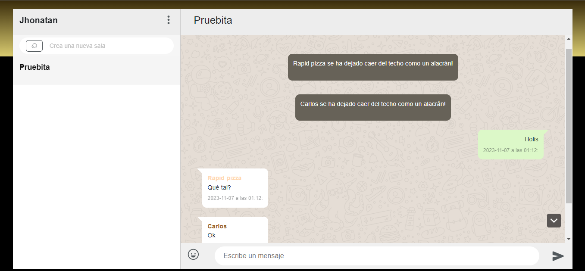

# Project2: Flack o WhatsApp 2

Sí, este es el project 2: Flack o como le llamo yo es WhatsApp 2, la interfaz de usuario es totalmente absurda y es totalmente intencional por seguir tendencias de memes.

## Imagenes del proyecto
### Menú inicio

### Menú Principal

### Lista de emojis

## Características

Este proyecto implementa las siguientes características, cumpliendo con los requisitos del Docs de Web50 para el proyecto Flack:

- **Nombre visual**: Interfaz con nombre visualmente atractivo.
- **Creación de canal**: Funcionalidad para crear nuevos canales de chat.
- **Listas de canales**: Visualización y navegación de la lista de canales disponibles.
- **Vista de Mensajes**: Interfaz para ver los mensajes en cada canal.
- **Envío de mensajes**: Capacidad para que los usuarios envíen mensajes.
- **Recordar el canal**: La aplicación recuerda el último canal visitado por el usuario.

### Toque Personal

Se han añadido características personalizadas para mejorar la experiencia del usuario:

- **Colores en textos de mensajes**: Implementación de colores en los textos para diferenciar los mensajes de los usuarios en el chat.
- **Lista de emojis con buscador**: Un buscador de emojis que funciona en inglés debido a limitaciones de la API gratuita.
- **Sonidos para mensajes**: Sonidos personalizados al enviar y recibir mensajes.
- **Validaciones para salas repetidas**: Verificaciones para evitar la creación de canales con nombres duplicados.
- **Botón para el último mensaje**: Botón para navegar rápidamente al último mensaje y funcionalidad automática para mostrar el último mensaje cuando se escribe en el chat.

## Tecnologías Utilizadas

El proyecto se desarrolló utilizando las siguientes tecnologías:

- HTML
- SASS
- CSS con el microframework Bootstrap
- Javascript con Socket.io
- Flask con extensión socket.io

## ¿Necesitas instalarlo?

1. Clonar el repositorio: `git clone https://github.com/usuario/project1.git`
2. Configurar las variables de entorno copiando el archivo `.env.template` a un nuevo archivo llamado `.env` y llenando las claves correspondientes.
5. Realizar un entorno virtual: `python -m venv venv`
6. Luego activarlo con: `venv/scripts/activate`
7. Instalar las dependencias con: `pip install -r requirements.txt`
8. Ejecutar la aplicación: `flask run`

## Autor

Jhontan Jazmil Medina Aguirre
Grupo D

